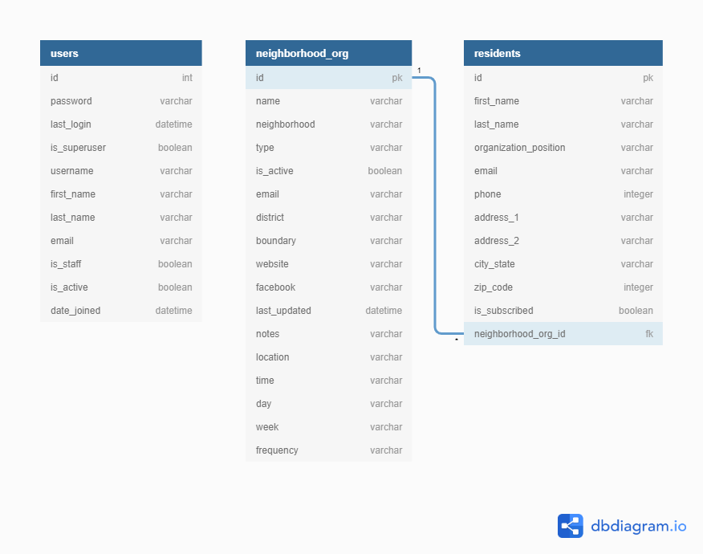

# City of Knoxville Neighborhood Portal
  The Neighborhood Portal is an app that allows users from the Knoxville Office of Neighborhoods to manage and view data related to neighborhood organizations and their resident members. The public can also use the app to view basic information on neighborhood organizations.

## Table of Contents
  * [Features List](#features-list)
  * [Technologies Used](#technologies-used)
  * [Installing and Launching the App](#installing-and-running-the-app)
  * [Planning Documentation](#planning-documentation)
    * [Entity Relationship Diagram](#entity-relationship-diagram)

## Features List

### Add Neighborhood Organizations
  Users can add a new neighborhood organization to the directory. They can specify general info about the organization such as category, district, and boundaries as well as add details about meetings.

### Add Residents
  feature description & image

### Search
  Users have the ability to search both the neighborhood and resident directories. 
  
  Neighborhood orgs can be searched by city council district, organization type, active/non-active, meeting nights, and organization name. 

  Residents can be searched by name and neighborhood organization name.

### Filtered Resident Views
  When looking at the resident directory, users can view a mailing list by filtering residents by those who whould like a newsletter.
  
### Public vs Private Views
  Only authorized users are able to view resident information and add data to the database, while the public is able to view available information about organizations.

## Technologies Used
  
  
  
  
  
  

## Installing and Running the App

  ----------------

  Clone this repo on your personal machine using the following command in your terminal
  ```sh
    git clone git@github.com:NSS-Post-Grad/knxhx-city-challenge.git
  ```

  Create and activate a virtual environment
  ```sh
    cd knxhx-city-challenge
    python manage.py venv cityDataEnv
    source ./cityDataEnv/bin/activate
  ```

  Install dependencies
  ```sh
    pip install -r requirements.txt
  ```

  Make migrations and migrate to create your database structure
  ```sh
    python manage.py makemigrations
    python manage.py migrate
  ```

  Load fixture data
  ```sh
    python manage.py loaddata neighborhood_org
    python manage.py loaddata resident
  ```
  
  Create a superuser, and follow the instructions in your terminal when prompted
  ```sh
    python manage.py createsuperuser
  ```

  To run the server, type
  ```sh
    python manage.py runserver
  ```

  Now that the server is up and running, you can open an internet browser and access the application
  ```sh
    http://localhost:8000/
  ```

## Planning Documentation

### Entity Relationship Diagram


  